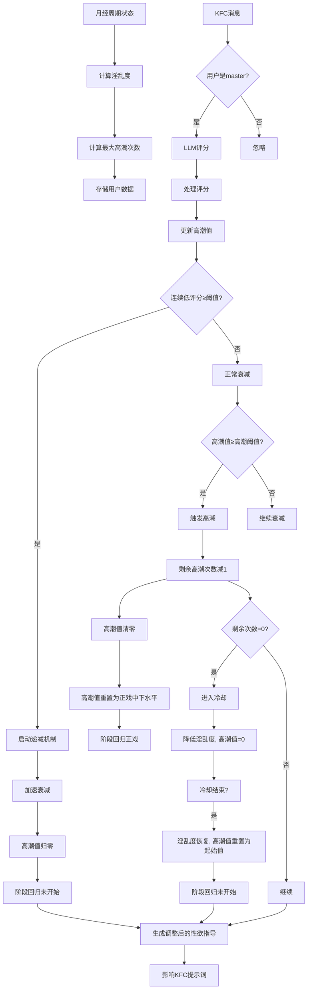

# 淫乱度与高潮值系统架构设计（详细版）

## 概述

本系统为月经周期插件增加一个淫乱度与高潮值子系统，仅针对KFC（私聊）模式。该系统通过后台计算影响性欲指导，实现更自然的性欲冷却和性交过程模拟。系统引入性行为阶段概念，使用LLM进行消息评分，并支持权限控制（仅master用户）。

## 核心概念

### 淫乱度 (Lust Level)
- 代表基于月经周期的性欲强度，范围 0.0 ~ 1.0。
- 计算方式：根据月经周期阶段（月经期、卵泡期、排卵期、黄体期）映射为数值。
- 作用：
  - 决定最大高潮次数。
  - 影响高潮值加权的权重（淫乱度高时评分加成更高）。
  - 影响性欲指导文本的强度。

### 高潮值 (Orgasm Value)
- 累积值，初始为与淫乱度相关的起始值（见“初始高潮值”），随时间衰减。
- 通过LLM对消息评分增加。
- 达到阈值时触发高潮，高潮值清零，剩余高潮次数减1。
- 作用：影响性欲表现（高潮值越高，性欲表现越强烈）。

### 初始高潮值 (Initial Orgasm Value)
初始高潮值（即系统启动或冷却恢复后的起始值）与当前淫乱度正相关，计算公式为：

```
initial_orgasm_value = lust_level * foreplay_threshold * initial_ratio
```

其中：
- `lust_level` 是当前淫乱度（0.0 ~ 1.0）。
- `foreplay_threshold` 是配置项“前戏阈值”。
- `initial_ratio` 是一个可配置的系数，默认值为 0.5，表示起始值位于前戏阈值的一半位置。

例如，若淫乱度为 0.5，前戏阈值为 20，`initial_ratio = 0.5`，则初始高潮值为 `0.5 * 20 * 0.5 = 5.0`。

该设计使得淫乱度越高，起始高潮值越接近前戏阈值，更容易进入前戏阶段，模拟性欲较强的初始状态。

根据初始高潮值与被动主动阈值（`passive_active_threshold`）的比较，起始阶段可能为“被动未开始”或“主动未开始”。例如，若被动主动阈值为 `foreplay_threshold * passive_active_ratio`（默认 20 * 0.3 = 6），则初始高潮值 5.0 处于被动未开始阶段；若淫乱度较高，初始高潮值可能超过 6，则进入主动未开始阶段。这种波动使得淫乱度不仅影响起始数值，还影响起始阶段的主动性。

### 性行为阶段 (Sexual Stage)
系统将性行为划分为五个阶段，基于高潮值与配置的阈值：

1. **被动未开始**：高潮值 < 被动主动阈值（`passive_active_threshold`）
2. **主动未开始**：被动主动阈值 ≤ 高潮值 < 前戏阈值
3. **前戏**：前戏阈值 ≤ 高潮值 < 正戏阈值
4. **正戏**：正戏阈值 ≤ 高潮值 < 高潮阈值
5. **高潮**：高潮值 ≥ 高潮阈值（触发高潮事件）

其中，被动主动阈值定义为 `passive_active_threshold = foreplay_threshold * passive_active_ratio`，`passive_active_ratio` 是一个可配置的系数（默认0.3）。

触发高潮后，系统不会进入休息阶段，而是立即将高潮值重置为正戏中下水平（`main_threshold * cooldown_recovery_ratio`），阶段回归“正戏”，以模拟“缓口气”并保持性行为连贯性。

### 最大高潮次数 (Max Orgasms)
最大高潮次数由淫乱度决定，计算公式为：

```
max_orgasms = max(1, int(lust_level * 5))
```

其中 `lust_level` 是当前淫乱度（0.0 ~ 1.0）。例如：
- 淫乱度 0.1 → 最大高潮次数 = 1
- 淫乱度 0.5 → 最大高潮次数 = 2
- 淫乱度 0.9 → 最大高潮次数 = 4

每次高潮消耗一次剩余高潮次数，用尽后进入冷却（淫乱度暂时降低）。

### 终止信号
系统有两种终止信号，行为不同：

1. **体力不支终止**（高潮次数用尽）：
   - 当剩余高潮次数 = 0 时触发。
   - 系统进入**冷却**状态，持续时间由 `cooldown_duration` 配置。
   - 冷却期间淫乱度暂时降低（例如减半），高潮值为0，并有专属提示词（如“体力不支、放空大脑”）。
   - 冷却结束后，淫乱度恢复到原始值（基于月经周期），高潮值重置为起始值（与淫乱度正相关），阶段回归“未开始”（具体为被动未开始或主动未开始，取决于初始高潮值）。

2. **递减机制终止**（连续低评分）：
   - 当LLM连续多次给出低评分（低于 `low_score_threshold`）时触发。
   - 系统不会进入冷却，而是启动**递减机制**：高潮值衰减率乘以 `termination_decay_multiplier`，加速高潮值下降，模拟兴趣快速下降。
   - 高潮值逐渐降低到初始高潮值后，阶段回归“被动未开始”。
   - 提示词反映兴趣下降（如“兴趣索然、不想继续”）。
   - 此过程没有单独的冷却时间，只是自然衰减。

### 权限控制
- 仅master用户可触发评分和查看淫乱度相关提示词。
- 使用Permission API检查用户权限。

## 系统组件

### 1. LustSystem 类

```python
class LustSystem:
    def __init__(self):
        self.storage = storage_api.get_local_storage("mofox_period_plugin")

    def calculate_lust_level(state: dict) -> float:
        """根据月经周期状态计算淫乱度"""

    def get_max_orgasms(lust_level: float) -> int:
        """根据淫乱度计算最大高潮次数"""

    def score_message_with_llm(text: str, lust_level: float) -> float:
        """使用LLM对消息内容评分，返回0-10的分数"""

    def process_score(user_id: str, score: float) -> dict:
        """处理评分，更新连续低评分计数，检查终止条件，更新高潮值"""

    def update_orgasm_value(user_id: str, score: float) -> dict:
        """更新用户的高潮值（考虑时间衰减），返回更新后的状态"""

    def get_sexual_guidance_adjustment(
        lust_level: float,
        orgasm_value: float,
        remaining_orgasms: int,
        current_stage: str
    ) -> str:
        """根据淫乱度、高潮值、剩余高潮次数、当前阶段生成性欲指导调整文本"""

    def get_user_data(user_id: str) -> dict:
        """获取用户数据，包括当前阶段、高潮值、剩余高潮次数等"""

    def decay_orgasm_value(user_id: str) -> float:
        """应用时间衰减并返回新值"""

    def reset_session(user_id: str):
        """主动结束会话，重置高潮值、阶段、连续低评分计数等"""

    def check_termination(user_id: str) -> bool:
        """检查是否应进入终止状态"""
```

### 2. 数据存储结构

#### 全局淫乱度缓存
- `lust_system:lust_level` -> float
- `lust_system:lust_level_date` -> str (YYYY-MM-DD)

#### 用户数据
键：`lust_system:user_data:{user_id}` -> dict
- `orgasm_value`: float (当前高潮值)
- `remaining_orgasms`: int (剩余高潮次数)
- `max_orgasms`: int (当前最大高潮次数)
- `last_updated`: float (时间戳)
- `cooldown_until`: float 或 None (冷却结束时间戳)
- `current_stage`: str (被动未开始、主动未开始、前戏、正戏、高潮、冷却)
- `consecutive_low_scores`: int (连续低评分计数)
- `termination_decay_multiplier`: float (递减机制中的衰减率乘数)
- `lust_level`: float (当前淫乱度缓存，可选)

### 3. 集成点

#### PeriodStatePrompt 修改
- 在生成提示词时，检查当前用户是否为master（使用permission_api）。
- 如果是master，调用 `LustSystem.get_sexual_guidance_adjustment` 获取调整文本，并合并到提示词中。
- 根据当前阶段调整性欲指导内容。

#### 新增 LustScoringHandler
- 继承 `BaseEventHandler`，订阅 `EventType.ON_MESSAGE`。
- 仅对master用户的KFC消息进行LLM评分。
- 调用 `LustSystem.process_score` 更新高潮值。
- 处理连续低评分和终止逻辑。

#### 新增命令（可选）
- `/lust_status`：显示淫乱度、高潮值、当前阶段、剩余高潮次数等（仅master可用）。
- `/lust_end`：主动结束当前会话（重置状态）。

#### 配置扩展
- 在 `config_schema` 中添加 `lust_system` 节，包含所有相关配置项。

## 工作流程



## 配置项

```toml
[lust_system]
enabled = true
orgasm_threshold = 100
foreplay_threshold = 20
main_threshold = 60
base_score_weight = 1.0
decay_rate = 0.1
post_orgasm_recovery_ratio = 0.4
initial_ratio = 0.5
passive_active_ratio = 0.3
low_score_threshold = 3.0
low_score_count_to_terminate = 3
termination_decay_multiplier = 2.0
cooldown_duration = 300
llm_model = "judge_model"  # 可选，使用系统默认judge模型
```

### 配置说明
- `enabled`: 是否启用淫乱度系统。
- `orgasm_threshold`: 高潮阈值，达到此值触发高潮。
- `foreplay_threshold`: 前戏阈值。
- `main_threshold`: 正戏阈值。
- `base_score_weight`: 基础得分权重，用于调整LLM评分对高潮值的影响。
- `decay_rate`: 高潮值衰减率（每秒减少的分数）。
- `post_orgasm_recovery_ratio`: 高潮后高潮值恢复比例，相对于 `main_threshold`（例如0.4表示恢复至正戏阈值的40%），用于模拟“缓口气”。
- `initial_ratio`: 初始高潮值系数，用于计算初始高潮值（`lust_level * foreplay_threshold * initial_ratio`），默认0.5。
- `passive_active_ratio`: 被动主动阈值系数，用于划分被动未开始和主动未开始（`passive_active_threshold = foreplay_threshold * passive_active_ratio`），默认0.3。
- `low_score_threshold`: 低评分阈值，低于此值视为低评分。
- `low_score_count_to_terminate`: 连续低评分次数触发终止。
- `termination_decay_multiplier`: 递减机制中的衰减率乘数，用于加速高潮值下降。
- `cooldown_duration`: 冷却持续时间（秒），仅用于体力不支终止（高潮次数用尽）。
- `llm_model`: 用于评分的LLM模型名称（可选）。

### 时间相关配置说明
系统只有一个冷却时间配置项：

- **`cooldown_duration`**（冷却持续时间）：
  - **触发时机**：当高潮次数用尽（剩余高潮次数 = 0）时，系统进入冷却状态。
  - **作用**：冷却期间淫乱度暂时降低（例如减半），高潮值为0，用户无法获得高潮次数，性欲指导会反映体力不支。
  - **典型值**：300秒（5分钟），模拟性欲满足后的短暂冷却。
  - **结束后的行为**：冷却结束后，淫乱度恢复到原始值（基于月经周期），高潮值重置为起始值（与淫乱度正相关），阶段回归“未开始”。

**注意**：递减机制（连续低评分）没有单独的冷却时间，只是通过 `termination_decay_multiplier` 加速高潮值衰减，直到归零。

## 详细设计

### 淫乱度计算
淫乱度基于月经周期状态计算，状态由 `PeriodStateManager` 提供（包含 `phase` 和 `day` 等信息）。计算方式如下：

| 周期阶段 (phase) | 基础淫乱度 | 说明 |
|----------------|------------|------|
| 月经期 (menstrual) | 0.1 | 性欲最低 |
| 卵泡期 (follicular) | 0.3 | 性欲逐渐上升 |
| 排卵期 (ovulation) | 0.9 | 性欲最高 |
| 黄体期 (luteal) | 0.5 | 性欲中等 |

可根据周期天数微调（例如黄体期后期淫乱度略升，排卵期前后波动）。具体公式为：

```
lust_level = base_lust[phase] + adjustment(day)
```

其中 `adjustment(day)` 是一个小范围调整（例如 ±0.1），用于模拟周期内的细微变化。

计算出的淫乱度范围限制在 0.0 ~ 1.0 之间。

### LLM评分提示词
```
你是一个判断消息是否具有性暗示或挑逗内容的助手。请分析以下消息，判断其是否包含性暗示、挑逗、性相关的内容。如果是，请给出一个0-10的分数，分数越高表示性暗示越强烈。如果没有任何性暗示，请输出0。

消息："{message_text}"

请只输出一个整数分数，不要输出其他任何内容。
```

### 时间衰减公式
每次读取用户数据时，计算时间差 `delta_seconds`，然后：
```
new_value = max(0, old_value - decay_rate * delta_seconds)
```
如果处于终止状态，衰减率乘以 `termination_decay_multiplier`。

### 阶段转换规则
- 当高潮值达到 `passive_active_threshold` 时，阶段从“被动未开始”变为“主动未开始”。
- 当高潮值达到 `foreplay_threshold` 时，阶段变为“前戏”。
- 达到 `main_threshold` 时，阶段变为“正戏”。
- 达到 `orgasm_threshold` 时，触发高潮，阶段变为“高潮”，然后立即执行高潮后恢复（高潮值重置为正戏中下水平，阶段回归“正戏”）。
- 如果剩余高潮次数 = 0，则进入冷却状态，阶段暂时为“冷却”（但不在常规阶段列表中），冷却结束后阶段回归“未开始”（具体为被动未开始或主动未开始取决于初始高潮值）。
- 如果连续低评分触发递减机制，高潮值逐渐降低到0，阶段回归“被动未开始”。

### 高潮后恢复与冷却恢复机制

#### 高潮后恢复
当触发高潮后（高潮值达到 `orgasm_threshold`），系统立即执行以下操作：
- 高潮值清零，剩余高潮次数减1。
- 高潮值重置为“正戏中下水平”，即 `main_threshold * post_orgasm_recovery_ratio`。
- 阶段回归“正戏”，以模拟“缓口气”并保持性行为连贯性。

#### 冷却恢复（体力不支终止后）
当冷却期结束后（即 `cooldown_until` 时间已过），系统执行以下恢复操作：
1. **淫乱度恢复**：淫乱度恢复到冷却前的原始值（基于月经周期重新计算）。
2. **高潮值重置**：高潮值设置为起始值，该起始值与淫乱度正相关，使用与“初始高潮值”相同的公式（`lust_level * foreplay_threshold * initial_ratio`）。
3. **阶段重置**：阶段回归“未开始”（具体为被动未开始或主动未开始，取决于重置后的高潮值初始值），因为性欲已满足，需要重新开始。
4. **剩余高潮次数重置**：根据恢复后的淫乱度重新计算最大高潮次数，并设置为剩余次数（即满额）。
5. **冷却状态清除**：`cooldown_until` 设为 None。

这样设计是为了模拟性欲得到满足后的冷却期：冷却期间性欲降低，冷却结束后性欲回到起始水平，高潮值从与淫乱度相关的起始值开始，而非从零开始。

### 性欲指导提示词示例
- **被动未开始**：性欲较低，对性接触兴趣不大，更倾向于情感交流，处于被动状态。
- **主动未开始**：性欲开始萌动，对性接触表现出一定兴趣，愿意主动参与轻度亲密，但尚未进入前戏。
- **前戏**：开始产生性趣，愿意接受轻度亲密，但还不渴望实质性行为。
- **正戏**：性欲强烈，主动寻求性接触，表现出明显的生理反应。
- **高潮**：达到性高潮，身心愉悦，但之后会进入短暂的不应期（通过高潮值重置模拟缓口气）。
- **冷却**（体力不支终止）：性欲得到满足后进入冷却，体力不支，放空大脑，性欲暂时降低。
- **递减机制终止**：意犹未尽，性欲仍有余热。。

这些文本将合并到原有的性欲指导中，替换或增强原有文本。

## 实现步骤

1. **创建 LustSystem 类**：在 `core/lust_system.py` 中实现。
2. **更新配置Schema**：修改 `config_schema.py`，添加 `lust_system` 节。
3. **创建评分事件处理器**：在 `components/lust_scoring_handler.py` 中实现 `LustScoringHandler`。
4. **修改 PeriodStatePrompt**：集成淫乱度系统，添加权限检查。
5. **添加命令**（可选）：创建 `/lust_status` 和 `/lust_end` 命令。
6. **更新插件注册**：在 `plugin.py` 的 `get_plugin_components` 中注册新组件。
7. **测试**：手动测试功能，确保权限、评分、阶段转换等正常工作。

## 注意事项
- 所有淫乱度相关功能仅对master用户开放。
- 评分和状态更新应避免频繁调用LLM，考虑性能。
- 存储数据时注意线程安全。
- 配置项应有合理的默认值，确保向后兼容。

## 待解决问题
- 是否需要按用户区分月经周期（目前是全局）？
- 冷却时间如何重置（每日重置？）？
- 是否允许非master用户查看淫乱度状态（目前禁止）？

请确认此设计是否符合您的预期，我将切换到编程模式进行实现。